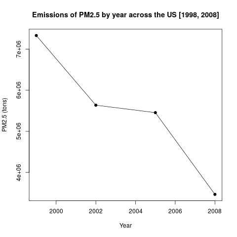

# Exploratory Data Analysis Course 2

## Introduction

**Dataset**: The dataset for this question is available [here](https://d396qusza40orc.cloudfront.net/exdata%2Fdata%2FNEI_data.zip). The dataset contains two files, the **PM2.5 emissions table** and the **Source Classification Code table**.

**Description**: The **PM2.5 emissions table** contains the data from years 1999, 2002, 2005 and 2008 of fine particulate matter emissions in tons by several sources across the United States. There are five fields in this table:

* fips: The five-digit number indicating the conty where the emissions were recorded;
* SCC: The name of the source as indicated by the **Source Classification Code table**;
* Pollutant: The type of pollutant;
* Emissions: The ammount of PM2.5 emissions recorded (in tons);
* type: The type of source for the emissions (`point`, `non-point`, `on-road`, `non-road`);
* year: The year that the emissions were recorded.

## Proposed questions

The following questions are addressed by this project:

1. Have total emissions from PM2.5 decreased in the United States from 1999 to 2008?

2. Have total emissions from PM2.5 decreased in the **Baltimore City, Maryland** (`fips == "24510"`) from 1999 to 2008?

3. Of the four types of sources indicated by the type (`point`, `nonpoint`, `onroad`, `nonroad`) variable, which of these four sources have seen decreases in emissions from 1999 to 2008 for **Baltimore City**? Which have seen increases in emissions from 1999 to 2008?

4. Across the United States, how have emissions from **coal combustion-related sources** changed from 1999 to 2008?

5. How have emissions from **motor vehicle sources** changed from 1999 to 2008 in **Baltimore City**?

6. Compare emissions from **motor vehicle sources** in **Baltimore City** with emissions from **motor vehicle sources** in **Los Angeles County, California** (`fips == "06037"`). Which city has seen greater changes over time in motor vehicle emissions?

## Source code

The source code to answer each question is named `plotN.R`, where `N` is the question number as stated in the previous section. Each script loads the datasets, filters it as necessary and produces the plots included in each answer.

